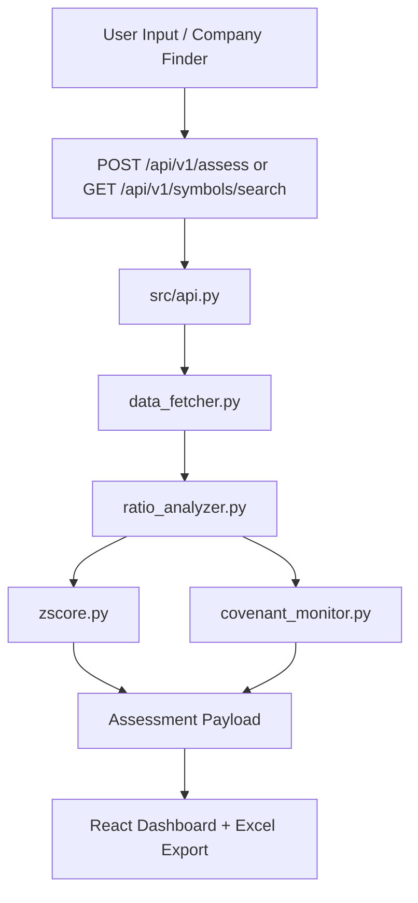

# RiskLens Architecture Overview

Language: [EN](./ARCHITECTURE.md) | [简中](./ARCHITECTURE_zh-CN.md) | [繁中](./ARCHITECTURE_zh-TW.md) | [日本語](./ARCHITECTURE_ja.md)

## 1. Runtime Topology

RiskLens currently supports two backend entry paths:

1. Dashboard path (default)
- Launcher: `./run_app.sh`
- Backend: `src/api.py` (`uvicorn api:app`)
- Frontend: `web/` React app served by FastAPI static routes
- Primary APIs: `/api/v1/assess`, `/api/v1/symbols/search`, `/api/v1/covenants/check`

2. MVP compatibility path
- Backend: `main.py`
- APIs: `/api/assess`, `/api/v1/assess`
- Used mainly for legacy smoke checks and backward compatibility

## 2. Backend Components (`src/`)

- `api.py`: request orchestration, error mapping, API routes, static hosting
- `data_fetcher.py`: market data retrieval (yfinance/AKShare fallback strategy)
- `ratio_analyzer.py`: ratio computation layer
- `zscore.py`: Altman Z-Score computation
- `covenant_monitor.py`: covenant rule checking with conservative fail policy

## 3. Frontend Components (`web/`)

- React + Vite SPA
- Main page search supports:
  - direct ticker input (single or comma-separated)
  - company finder dialog (calls `/api/v1/symbols/search`, supports multi-select write-back)
- Statement modal supports synonym folding + standard-order rendering (USGAAP/IFRS/CAS mapping)
- Excel export logic is implemented in `web/src/App.tsx` (`exportToExcel`)

## 4. API Surface (Dashboard Path)

- `GET /`: dashboard UI
- `GET /health`: health check
- `GET /docs`: OpenAPI docs
- `POST /api/v1/assess`: risk assessment (single/multi ticker)
- `GET /api/v1/symbols/search`: equity symbol suggestions for company finder
- `POST /api/v1/covenants/check`: covenant check

## 5. Data Flow

## 6. Why This Document Exists

This document defines *system boundaries and runtime truth*.
Use it when validating entrypoints, API ownership, and frontend/backend responsibilities.
