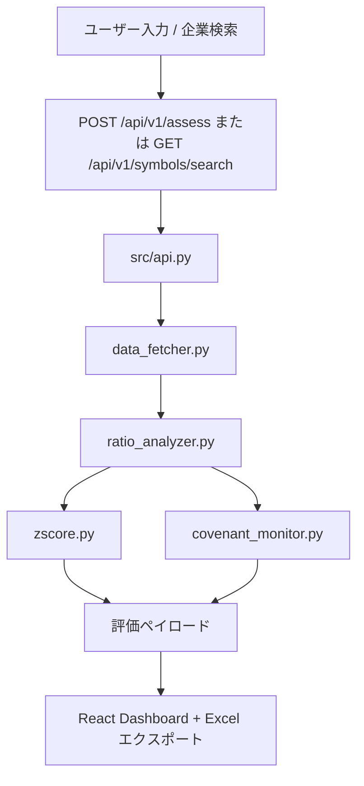

# RiskLens アーキテクチャ概要

Language: [EN](./ARCHITECTURE.md) | [简中](./ARCHITECTURE_zh-CN.md) | [繁中](./ARCHITECTURE_zh-TW.md) | [日本語](./ARCHITECTURE_ja.md)

## 1. ランタイム構成

RiskLens は現在、2 つのバックエンド入口パスをサポートしています。

1. Dashboard パス（デフォルト）
- 起動：`./run_app.sh`
- バックエンド：`src/api.py`（`uvicorn api:app`）
- フロントエンド：`web/` React アプリを FastAPI の静的ルートで配信
- 主 API：`/api/v1/assess`、`/api/v1/symbols/search`、`/api/v1/covenants/check`

2. MVP 互換パス
- バックエンド：`main.py`
- API：`/api/assess`、`/api/v1/assess`
- 主にレガシー smoke チェックと後方互換向け

## 2. バックエンドコンポーネント（`src/`）

- `api.py`：リクエスト制御、エラーマッピング、API ルーティング、静的配信
- `data_fetcher.py`：市場データ取得（yfinance/AKShare フォールバック）
- `ratio_analyzer.py`：財務比率計算レイヤー
- `zscore.py`：Altman Z-Score 計算
- `covenant_monitor.py`：コベナンツ判定（保守的 fail ポリシー）

## 3. フロントエンドコンポーネント（`web/`）

- React + Vite SPA
- トップページ検索機能：
  - ticker 直接入力（単一またはカンマ区切り）
  - 企業検索ダイアログ（`/api/v1/symbols/search` を呼び出し、複数選択で入力欄へ反映）
- 財務諸表モーダルは同義項目の折りたたみと標準順序表示（USGAAP/IFRS/CAS マッピング）をサポート
- Excel 出力ロジックは `web/src/App.tsx`（`exportToExcel`）に実装

## 4. API サーフェス（Dashboard パス）

- `GET /`：Dashboard UI
- `GET /health`：ヘルスチェック
- `GET /docs`：OpenAPI ドキュメント
- `POST /api/v1/assess`：リスク評価（単一/複数 ticker）
- `GET /api/v1/symbols/search`：企業検索候補
- `POST /api/v1/covenants/check`：コベナンツチェック

## 5. データフロー

## 6. この文書の目的

本書はシステム境界とランタイムの事実を定義し、入口パス、API 所有、フロント/バックの責務を検証するために使用します。
