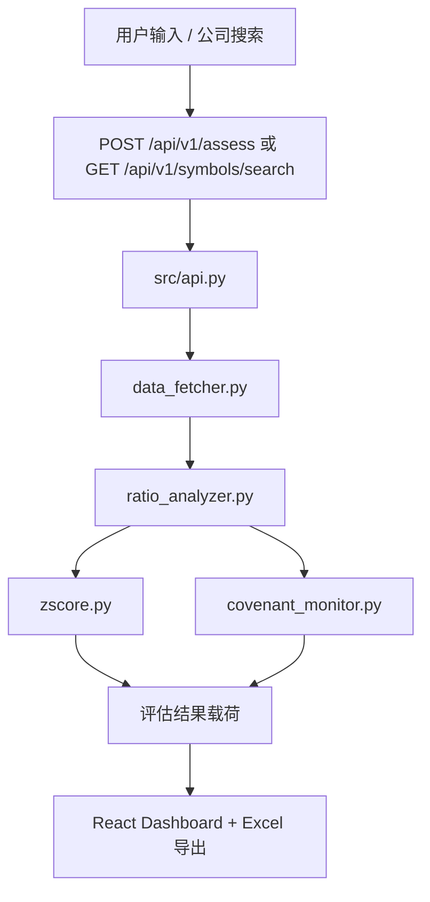

# RiskLens 架构总览

语言: [EN](./ARCHITECTURE.md) | [简中](./ARCHITECTURE_zh-CN.md) | [繁中](./ARCHITECTURE_zh-TW.md) | [日本語](./ARCHITECTURE_ja.md)

## 1. 运行拓扑

RiskLens 当前支持两条后端入口路径：

1. Dashboard 路径（默认）
- 启动方式：`./run_app.sh`
- 后端：`src/api.py`（`uvicorn api:app`）
- 前端：`web/` React 应用由 FastAPI 静态路由托管
- 主接口：`/api/v1/assess`、`/api/v1/symbols/search`、`/api/v1/covenants/check`

2. MVP 兼容路径
- 后端：`main.py`
- 接口：`/api/assess`、`/api/v1/assess`
- 主要用于历史冒烟检查和向后兼容

## 2. 后端组件（`src/`）

- `api.py`：请求编排、错误映射、API 路由、静态托管
- `data_fetcher.py`：市场数据抓取（yfinance/AKShare 回退策略）
- `ratio_analyzer.py`：财务比率计算层
- `zscore.py`：Altman Z-Score 计算
- `covenant_monitor.py`：契约规则检查（保守失败策略）

## 3. 前端组件（`web/`）

- React + Vite 单页应用
- 首页搜索支持：
  - 直接输入 ticker（单个或逗号分隔）
  - 公司搜索弹窗（调用 `/api/v1/symbols/search`，支持多选回填）
- 财报弹窗支持同义项折叠 + 标准顺序展示（USGAAP/IFRS/CAS 映射）
- Excel 导出逻辑位于 `web/src/App.tsx`（`exportToExcel`）

## 4. API 面（Dashboard 路径）

- `GET /`：Dashboard UI
- `GET /health`：健康检查
- `GET /docs`：OpenAPI 文档
- `POST /api/v1/assess`：风险评估（单/多 ticker）
- `GET /api/v1/symbols/search`：公司搜索候选
- `POST /api/v1/covenants/check`：契约检查

## 5. 数据流

## 6. 文档目的

本文档定义系统边界和运行事实，用于校验入口路径、API 归属和前后端职责划分。
