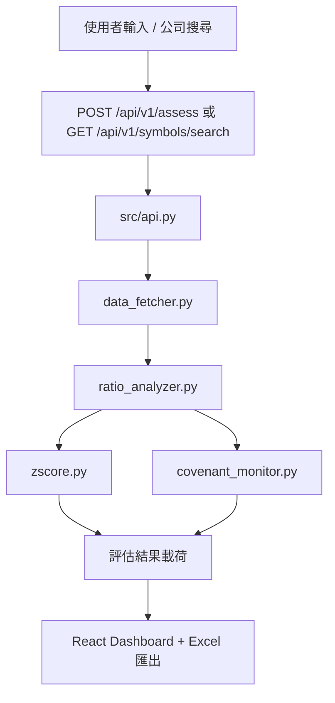

# RiskLens 架構總覽

語言: [EN](./ARCHITECTURE.md) | [简中](./ARCHITECTURE_zh-CN.md) | [繁中](./ARCHITECTURE_zh-TW.md) | [日本語](./ARCHITECTURE_ja.md)

## 1. 執行拓樸

RiskLens 目前支援兩條後端入口路徑：

1. Dashboard 路徑（預設）
- 啟動方式：`./run_app.sh`
- 後端：`src/api.py`（`uvicorn api:app`）
- 前端：`web/` React 應用由 FastAPI 靜態路由託管
- 主要 API：`/api/v1/assess`、`/api/v1/symbols/search`、`/api/v1/covenants/check`

2. MVP 相容路徑
- 後端：`main.py`
- API：`/api/assess`、`/api/v1/assess`
- 主要用於歷史 smoke 檢查與向後相容

## 2. 後端元件（`src/`）

- `api.py`：請求編排、錯誤映射、API 路由、靜態託管
- `data_fetcher.py`：市場資料抓取（yfinance/AKShare 回退策略）
- `ratio_analyzer.py`：財務比率計算層
- `zscore.py`：Altman Z-Score 計算
- `covenant_monitor.py`：契約規則檢查（保守失敗策略）

## 3. 前端元件（`web/`）

- React + Vite SPA
- 首頁搜尋支援：
  - 直接輸入 ticker（單一或逗號分隔）
  - 公司搜尋視窗（呼叫 `/api/v1/symbols/search`，支援多選回填）
- 財報視窗支援同義項折疊 + 標準順序呈現（USGAAP/IFRS/CAS 映射）
- Excel 匯出邏輯位於 `web/src/App.tsx`（`exportToExcel`）

## 4. API 面（Dashboard 路徑）

- `GET /`：Dashboard UI
- `GET /health`：健康檢查
- `GET /docs`：OpenAPI 文件
- `POST /api/v1/assess`：風險評估（單/多 ticker）
- `GET /api/v1/symbols/search`：公司搜尋候選
- `POST /api/v1/covenants/check`：契約檢查

## 5. 資料流

## 6. 文件目的

本文定義系統邊界與執行事實，用於驗證入口路徑、API 歸屬與前後端職責。
