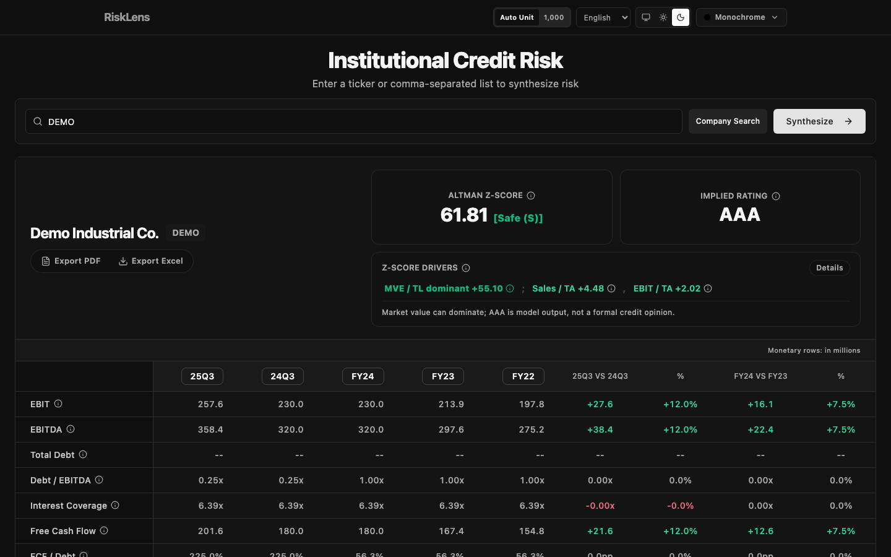
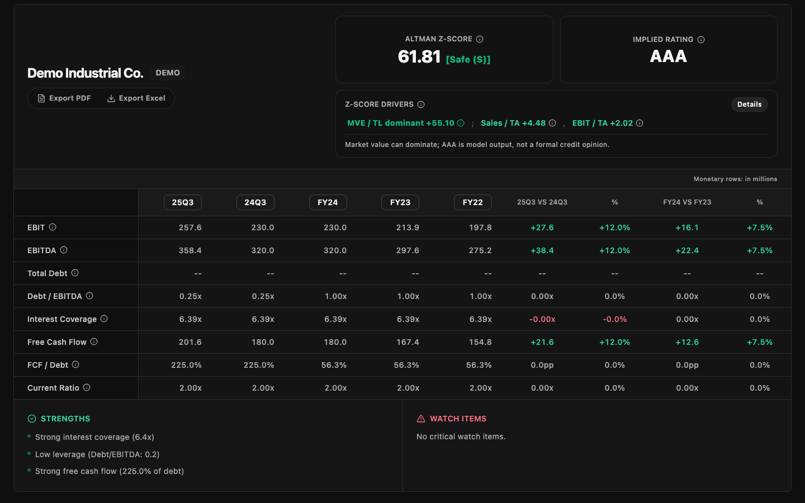
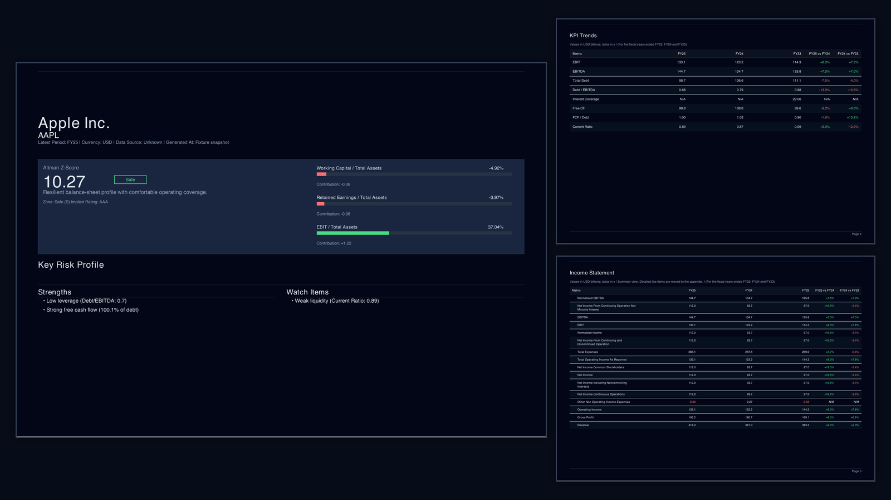
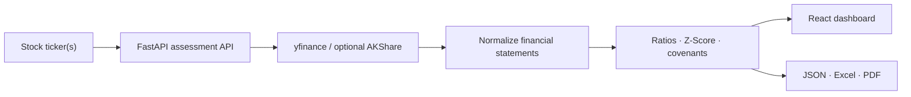

# RiskLens

[English](./README.md) · [简体中文](./docs/readme/README_zh-CN.md) · [繁體中文](./docs/readme/README_zh-TW.md) · [日本語](./docs/readme/README_ja.md)

**An institutional-style credit risk workbench that turns public-company financials into explainable risk signals, covenant checks, and presentation-ready reports.**

[](https://github.com/rightleung/RiskLens/actions/workflows/ci.yml)
[](https://www.python.org/)
[](https://fastapi.tiangolo.com/)
[](https://react.dev/)
[](./LICENSE)



RiskLens accepts one or more stock tickers, retrieves and normalizes public financial data, calculates 40+ ratios and an Altman Z-Score, maps the result to an implied credit rating, and presents the analysis in a multilingual React dashboard. The same assessment can be exported as JSON, Excel, or PDF for review and discussion.

## Highlights

- **40+ financial ratios** across liquidity, solvency, profitability, efficiency, and cash flow.
- **Multi-company, multi-period analysis** with annual and quarterly views.
- **Altman Z-Score and implied rating** with interpretable risk zones and contributing factors.
- **Covenant monitoring** with configurable thresholds and conservative missing-data handling.
- **JSON, Excel, and PDF exports** for downstream analysis and presentation.
- **Four interface languages:** English, Simplified Chinese, Traditional Chinese, and Japanese.
- **308 automated tests at the v1.2.0 release**, plus frontend lint, build, browser preflight, and dependency audits in CI.

## Product views





## How it works



The primary dashboard uses the multi-period `RichAssessmentService`; a smaller compatibility service remains available for the legacy entry point.

## Engineering decisions

- **Missing covenant data fails conservatively.** If a configured covenant cannot be evaluated because its input is unavailable, RiskLens flags it as a breach pending manual review instead of silently passing it.
- **Synchronous market-data work is isolated.** FastAPI offloads pandas and provider calls to worker threads, while per-ticker timeouts and a semaphore keep concurrent requests bounded.
- **Quarterly results remain comparable.** Flow-based quarterly figures are annualized for ratio analysis, with an annual-period fallback when a quarterly Z-Score cannot produce a defensible rating.
- **CJK reports use bundled fonts.** ReportLab renders English, Simplified Chinese, Traditional Chinese, and Japanese PDFs with packaged Noto Sans CJK fonts and explicit pagination controls.

## Quick start

### Requirements

- Python 3.12+
- Node.js and npm
- Network access for live market data

Build the Python environment and React application:

```bash
./scripts/rebuild_workspace.sh
```

Start the local dashboard:

```bash
./run_app.sh
```

Open `http://127.0.0.1:8000`. To install optional AKShare-backed China-market support, use:

```bash
RISKLENS_WITH_CN_DATA=1 ./scripts/rebuild_workspace.sh
```

The deterministic `DEMO` ticker exercises the core dashboard without depending on a live company response.

## Command line

```bash
./run_cli.sh assess AAPL MSFT --data-source yfinance
./run_cli.sh search apple --limit 10
./run_cli.sh covenants AAPL --min-current-ratio 1.2 --max-debt-to-equity 2.0
```

Add `--output path/to/file.json` to save an assessment, or run `./run_cli.sh --help` for all commands.

## API

Interactive OpenAPI documentation is available locally at `http://127.0.0.1:8000/docs`.

| Method and endpoint | Purpose |
|---|---|
| `GET /health` | Check service status and version |
| `POST /api/v1/assess` | Assess one or more companies |
| `GET /api/v1/symbols/search` | Find a listed-company ticker |
| `POST /api/v1/covenants/check` | Evaluate configured covenant limits |
| `POST /api/v1/reports/pdf` | Generate a single-company PDF |
| `POST /api/v1/reports/pdf/batch` | Download up to ten reports as a ZIP |

## Validation

The release gate runs backend tests, packaging checks, frontend lint and production builds, Playwright browser preflight, and Python/npm dependency audits.

```bash
python -m pip check
python -m pytest -q

cd web
npm run lint
npm run build
npm run e2e:preflight
```

CI also verifies that the bundled CJK font assets are present and that both the Python package and React production bundle can be built from a clean checkout.

## Development process

Codex assisted with implementation, refactoring, and test development. Changes were treated as engineering inputs—not accepted solely because they were generated—and were validated through automated tests, dependency audits, CI, rendered-report inspection, and manual product QA.

## Methodology and limitations

- The implied rating is a RiskLens interpretation for internal screening, not a rating issued by S&P or another credit-rating agency.
- Public market data may be delayed, restated, incomplete, or mapped differently across accounting standards.
- Historical Z-Scores may use current market capitalization when historical market values are unavailable.
- Altman Z-Score is one signal; industry structure, ownership, liquidity, and qualitative factors still require professional judgment.
- RiskLens does not provide investment, legal, accounting, credit-rating, or lending advice.

## Documentation

- [Architecture](./docs/architecture/ARCHITECTURE.md)
- [Credit-risk methodology](./docs/methodology/METHODOLOGY.md)
- [Excel report specification](./docs/report-workbook/REPORT_WORKBOOK_SPEC.md)
- [Localized documentation index](./docs/readme/README.md)
- [Release checklist](./docs/review/repository-release-checklist.md)

## License

RiskLens is released under the [MIT License](./LICENSE).
