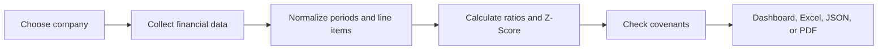

# How RiskLens works

Language: [EN](./ARCHITECTURE.md) | [简中](./ARCHITECTURE_zh-CN.md) | [繁中](./ARCHITECTURE_zh-TW.md) | [日本語](./ARCHITECTURE_ja.md)

RiskLens follows a simple path: find a company, prepare its financial data, calculate risk signals, and present the result in a form that is easy to review or share.

## The assessment journey

### 1. Choose a company

Users can search by company name or enter one or more tickers. The same assessment flow is available from the dashboard, command line, and API.

### 2. Prepare the data

Yahoo Finance is the default source for global listed companies. AKShare can add China-market coverage. RiskLens aligns financial periods, standardizes common statement labels, and records missing inputs rather than hiding them.

### 3. Build the risk view

The analysis combines 40+ financial ratios with the Altman Z-Score. If covenant limits are provided, actual values are checked against them. Missing data for a configured covenant is flagged for review and treated as a breach until verified.

### 4. Present the result

The React dashboard shows the latest assessment, trends, company comparisons, statements, and data-quality notes. The same result can be exported to JSON, Excel, or PDF in four supported languages.

## Product areas

| Area | What it does |
|---|---|
| Experience | Search, assessment, comparison, and exports |
| Data | Fetch, cache, normalize, and validate financial inputs |
| Analysis | Calculate ratios, Z-Score, implied rating, and covenant status |
| Reporting | Prepare localized Excel and PDF outputs |

## Reliability choices

- Slow network and calculation work runs outside the main request loop.
- Per-company timeouts and concurrency limits prevent one request from consuming all capacity.
- Non-finite numbers are removed before JSON output.
- Missing covenant data is never silently marked as a pass.
- Sentry monitoring is optional and stays disabled unless configured.

## Maintainer map

The primary product runs from `src/api.py` and serves the React build in `web/dist/`. Analysis lives in `src/services/`, `src/data_fetcher.py`, `src/ratio_analyzer.py`, `src/zscore.py`, and `src/covenant_monitor.py`. Report generation lives in the PDF modules under `src/` and the Excel export in `web/src/App.tsx`.

The root `main.py` is a compatibility path, not the primary product entry point.
