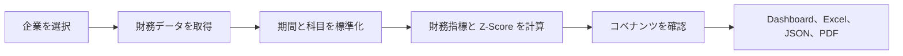

# RiskLens の仕組み

言語：[EN](./ARCHITECTURE.md) | [简中](./ARCHITECTURE_zh-CN.md) | [繁中](./ARCHITECTURE_zh-TW.md) | [日本語](./ARCHITECTURE_ja.md)

RiskLens の流れはシンプルです。企業を選び、財務データを整え、リスク指標を計算し、確認・共有しやすい形で結果を表示します。

## 評価の流れ

### 1. 企業を選ぶ

会社名で検索するか、1つまたは複数の銘柄コードを入力します。Dashboard、コマンドライン、API は同じ評価フローを利用します。

### 2. データを整える

グローバル上場企業には Yahoo Finance を標準で利用し、中国市場の追加データには AKShare を利用できます。RiskLens は財務期間と一般的な財務科目をそろえ、不足している入力を明示します。

### 3. リスクビューを作る

40以上の財務指標と Altman Z-Score を組み合わせます。コベナンツ基準が設定されている場合は、実績値と比較します。必要なデータがない場合は確認対象として示し、確認が終わるまで違反として扱います。

### 4. 結果を表示する

React Dashboard には最新評価、過去の推移、企業比較、財務諸表、データ品質の注記が表示されます。同じ結果を4言語の JSON、Excel、PDF に出力できます。

## 製品を構成する4つの領域

| 領域 | 役割 |
|---|---|
| 画面 | 検索、評価、比較、出力 |
| データ | 財務入力の取得、キャッシュ、標準化、検証 |
| 分析 | 財務指標、Z-Score、インプライド格付け、コベナンツ状態の計算 |
| レポート | 多言語の Excel と PDF の作成 |

## 信頼性のための設計

- ネットワーク処理と重い計算は、主要なリクエスト処理を止めないように実行します。
- 企業ごとのタイムアウトと同時実行数の制限で、1件のリクエストによる占有を防ぎます。
- JSON 出力前に NaN と無限値を除去します。
- コベナンツに必要なデータがない場合、合格として黙って処理しません。
- Sentry 監視は任意で、設定されていない場合は無効です。

## メンテナー向け早見表

メイン製品は `src/api.py` から起動し、`web/dist/` の React ビルドを配信します。分析は `src/services/`、`src/data_fetcher.py`、`src/ratio_analyzer.py`、`src/zscore.py`、`src/covenant_monitor.py` にあります。PDF は `src/` のレポートモジュール、Excel 出力は `web/src/App.tsx` にあります。

ルートの `main.py` は互換性用であり、メインの製品エントリーポイントではありません。
