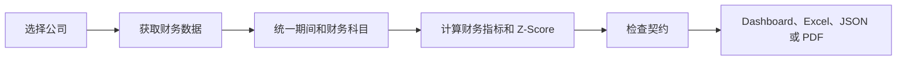

# RiskLens 如何工作

语言：[EN](./ARCHITECTURE.md) | [简中](./ARCHITECTURE_zh-CN.md) | [繁中](./ARCHITECTURE_zh-TW.md) | [日本語](./ARCHITECTURE_ja.md)

RiskLens 的流程很直接：找到公司，整理财务数据，计算风险信号，再把结果以便于查看和分享的方式呈现出来。

## 一次评估如何完成

### 1. 选择公司

用户可以按公司名称搜索，也可以输入一个或多个股票代码。Dashboard、命令行和 API 使用同一套评估流程。

### 2. 整理数据

全球上市公司默认使用 Yahoo Finance，也可以通过 AKShare 补充中国市场数据。RiskLens 会对齐财务期间、统一常见财报科目，并明确记录缺失输入。

### 3. 形成风险视图

分析会结合 40+ 财务指标和 Altman Z-Score。如果设置了契约阈值，系统会把实际值与阈值比较。已设置契约但数据缺失时，会标记为需要复核，并在确认前暂按违约处理。

### 4. 展示结果

React Dashboard 展示最新评估、历史趋势、公司对比、财务报表和数据质量提示。同一结果可以用四种语言导出为 JSON、Excel 或 PDF。

## 产品的四个部分

| 部分 | 作用 |
|---|---|
| 使用体验 | 搜索、评估、对比和导出 |
| 数据 | 获取、缓存、标准化和校验财务输入 |
| 分析 | 计算财务指标、Z-Score、隐含评级和契约状态 |
| 报告 | 生成多语言 Excel 和 PDF |

## 可靠性原则

- 网络请求和较重计算不会阻塞主请求循环。
- 单公司超时和并发限制可避免一个请求占满服务容量。
- 输出 JSON 前会清理 NaN 和无穷值。
- 契约所需数据缺失时，绝不会静默标记为通过。
- Sentry 监控为可选项，未配置时保持关闭。

## 维护者速查

主产品从 `src/api.py` 启动，并托管 `web/dist/` 中的 React 构建结果。分析逻辑集中在 `src/services/`、`src/data_fetcher.py`、`src/ratio_analyzer.py`、`src/zscore.py` 和 `src/covenant_monitor.py`。PDF 位于 `src/` 的报告模块，Excel 导出位于 `web/src/App.tsx`。

根目录 `main.py` 是兼容路径，不是主产品入口。
