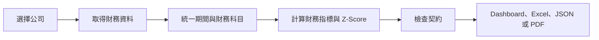

# RiskLens 如何運作

語言：[EN](./ARCHITECTURE.md) | [简中](./ARCHITECTURE_zh-CN.md) | [繁中](./ARCHITECTURE_zh-TW.md) | [日本語](./ARCHITECTURE_ja.md)

RiskLens 的流程很直接：找到公司、整理財務資料、計算風險訊號，再把結果以方便檢視與分享的方式呈現。

## 一次評估如何完成

### 1. 選擇公司

使用者可以依公司名稱搜尋，也可以輸入一個或多個股票代碼。Dashboard、命令列與 API 使用同一套評估流程。

### 2. 整理資料

全球上市公司預設使用 Yahoo Finance，也可以透過 AKShare 補充中國市場資料。RiskLens 會對齊財務期間、統一常見財報科目，並明確記錄缺失輸入。

### 3. 形成風險視圖

分析結合 40+ 財務指標與 Altman Z-Score。若設定契約門檻，系統會比較實際值與門檻。已設定契約但資料缺失時，會標記為需要覆核，並在確認前暫按違約處理。

### 4. 呈現結果

React Dashboard 顯示最新評估、歷史趨勢、公司比較、財務報表與資料品質提示。同一結果可以用四種語言匯出為 JSON、Excel 或 PDF。

## 產品的四個部分

| 部分 | 作用 |
|---|---|
| 使用體驗 | 搜尋、評估、比較與匯出 |
| 資料 | 取得、快取、標準化與驗證財務輸入 |
| 分析 | 計算財務指標、Z-Score、隱含評級與契約狀態 |
| 報告 | 產生多語言 Excel 與 PDF |

## 可靠性原則

- 網路請求與較重計算不會阻塞主要請求迴圈。
- 單一公司逾時與並行限制可避免一個請求占滿服務容量。
- 輸出 JSON 前會清理 NaN 與無窮值。
- 契約所需資料缺失時，絕不會默認為通過。
- Sentry 監控為選用功能，未設定時保持關閉。

## 維護者速查

主要產品從 `src/api.py` 啟動，並提供 `web/dist/` 中的 React 建置結果。分析邏輯集中在 `src/services/`、`src/data_fetcher.py`、`src/ratio_analyzer.py`、`src/zscore.py` 與 `src/covenant_monitor.py`。PDF 位於 `src/` 的報告模組，Excel 匯出位於 `web/src/App.tsx`。

根目錄 `main.py` 是相容路徑，不是主要產品入口。
